# Warehouse Inventory System

Inventory system for warehouse staff to manage products, record stock movements, scan barcodes, and monitor low-stock products.

## What Is Included

- .NET 8 Web API
- PostgreSQL with EF Core migrations
- Product CRUD with search, category filter, and pagination
- Normalized categories and warehouse locations
- Barcode lookup endpoint
- Stock movement endpoint with explicit transaction handling
- Negative-stock validation
- Unique SKU and optional unique barcode constraints
- Repository + Unit of Work structure
- FluentValidation request validation
- Structured stock-change logging
- Optimistic concurrency with a `Version` token
- Barcode lookup
- Stock movement workflow with transaction handling
- Low-stock alerts dashboard
- Angular 18 frontend
- Docker Compose for PostgreSQL, backend, frontend, and pgAdmin

## Setup Instructions

### Docker

1. Copy the example environment file to the repository root and fill in the values.

```bash
copy .env.example .env
```

2. Start the stack.

```bash
docker compose up -d --build
or
docker compose up --build
```

3. Open the services.

- Frontend: http://localhost:8080
- Backend API: http://localhost:5000
- Swagger UI: http://localhost:5000/swagger
- Health check: http://localhost:5000/health
- pgAdmin: http://localhost:5050

The backend applies EF Core migrations on startup when `ApplyMigrations=true`.

## API Examples

Swagger is available at http://localhost:5000/swagger, and the OpenAPI document can be imported into Postman from http://localhost:5000/swagger/v1/swagger.json.

### Create Product

```bash
curl -X POST http://localhost:5000/api/products ^
  -H "Content-Type: application/json" ^
  -d "{\"sku\":\"PROD-001\",\"barcode\":\"1234567890\",\"name\":\"Box Cutter\",\"category\":\"Tools\",\"location\":\"A1-B2\",\"price\":9.99,\"reorderThreshold\":50}"
```

### List Products

```bash
curl "http://localhost:5000/api/products?search=box&page=1&pageSize=20"
```

### Lookup Product By Barcode

```bash
curl "http://localhost:5000/api/products/barcode/1234567890"
```

### Register Stock Movement

```bash
curl -X POST http://localhost:5000/api/stock/movements ^
  -H "Content-Type: application/json" ^
  -d "{\"productId\":\"PRODUCT_ID_HERE\",\"quantityChange\":40,\"reason\":\"received\",\"createdBy\":\"warehouse1\",\"version\":\"VERSION_FROM_PRODUCT_DETAILS\"}"
```

### Low Stock Alerts

```bash
curl "http://localhost:5000/api/stock/alert/low"
```

### Movement History

```bash
curl "http://localhost:5000/api/stock/movements/PRODUCT_ID_HERE"
```

## Concurrency Handling

The application uses optimistic concurrency on the `Products` entity through a `Version` token.

- Every read returns the current version.
- The client must send that version back when updating a product or logging a stock movement.
- After a successful write, the API generates a new version.
- If another request already changed the same record, EF Core detects the mismatch and the API returns `409 Conflict`.

This approach keeps the system fast and avoids locking rows for long periods. Stock movements are also wrapped in an explicit transaction so the stock update and the movement record are committed together or rolled back together.

## Demo Screenshots

### Product List

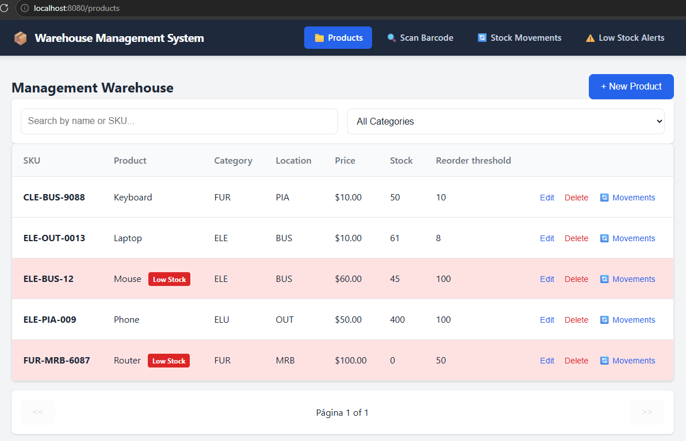

### New Product Form

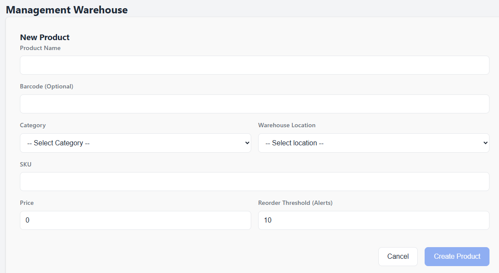

### Barcode Search

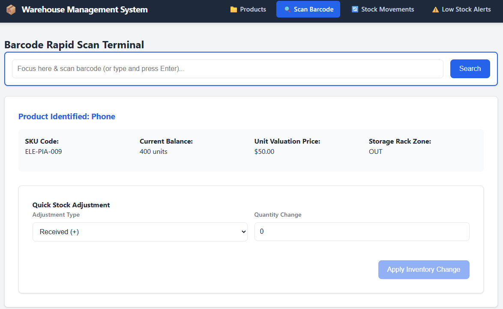

### Confirm Delete Modal

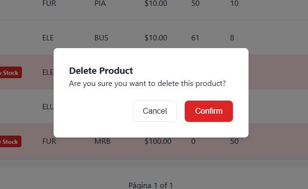

### Stock Movement

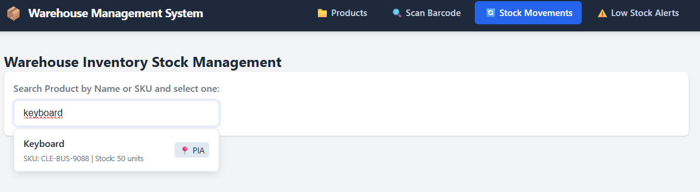

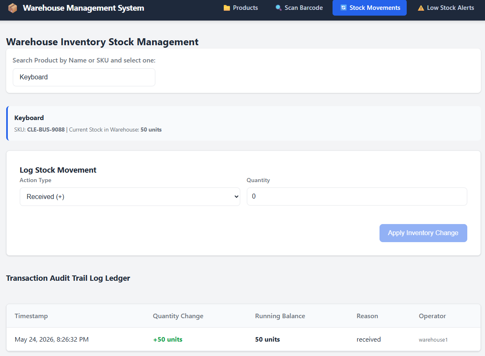

### Concurrency Conflict Example

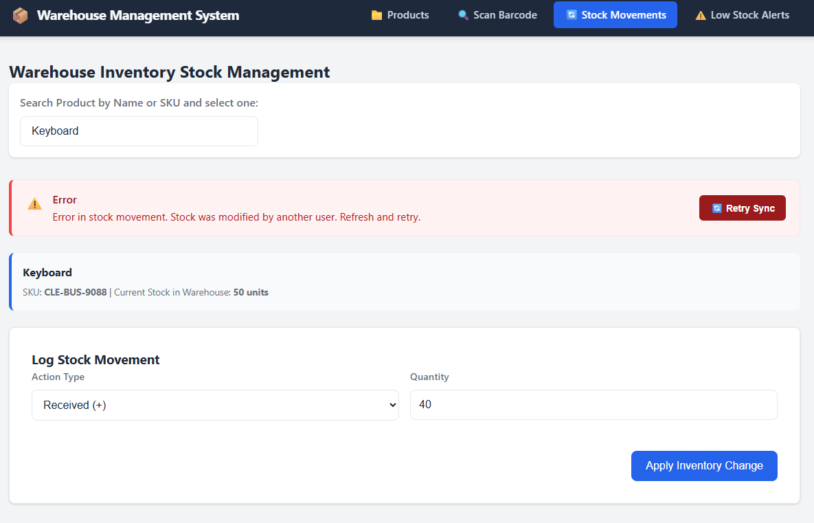

### Low Stock Dashboard

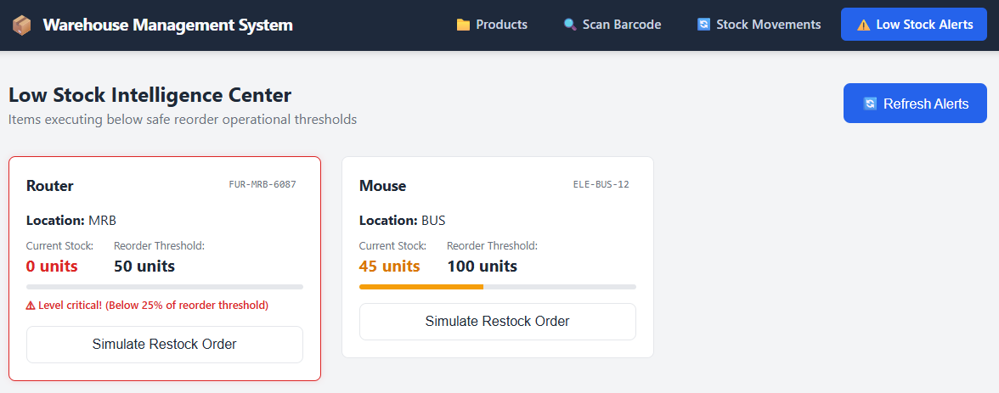

### Responsive Views

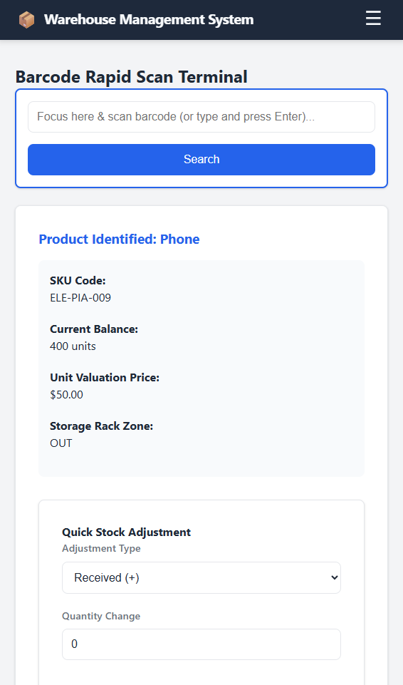

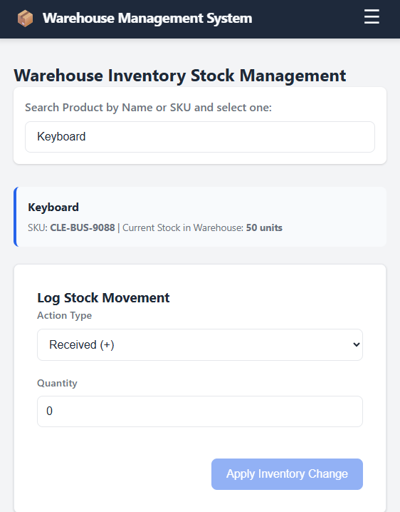

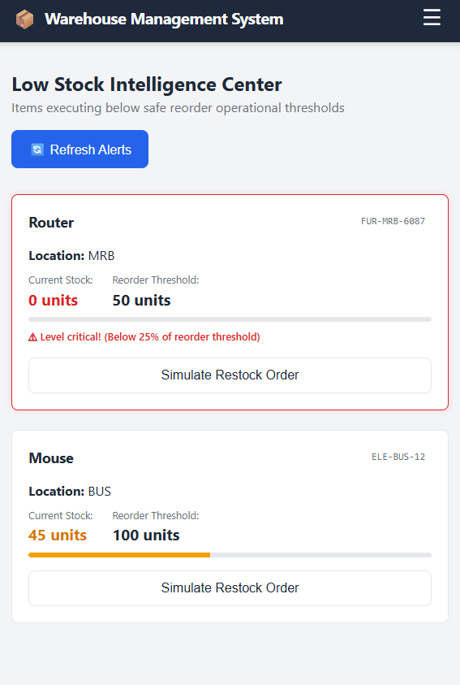

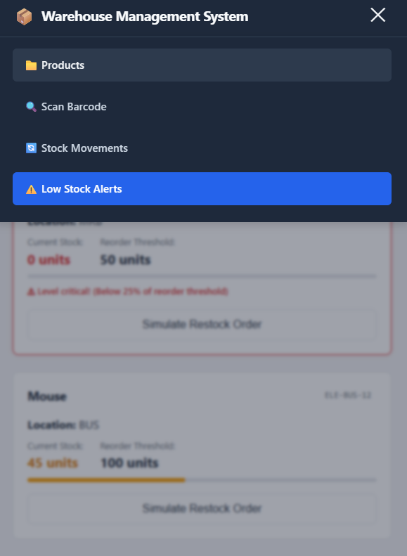

## Notes

- The repository root `.env.example` contains the variables used by Docker Compose.